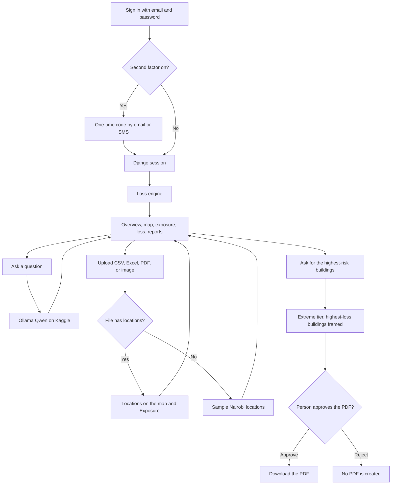

# CAT Intelligence

Nairobi urban flood catastrophe model for the Kenya Re AI4Insurance Hackathon 2026 (Team A).

The application reads a synthetic building portfolio, runs a deterministic loss engine, and serves the results through a Django API to a React interface. Figures on screen are copied from the engine. The CAT Copilot answers questions through Ollama serving Qwen on Kaggle.

```
Hazard → Exposure → Vulnerability → Financial loss → Portfolio risk → Review
```

## Workflow

A person signs in, reads the engine results, and can ask the Copilot to move through the same screens. Loss numbers stay in the engine. The language model explains those numbers and does not calculate them.



1. **Sign in.** Email and password are checked first. When email or SMS verification is on, the session starts only after the one-time code is accepted. SMS for the administrator goes to the phone number stored on that account.
2. **Open the portfolio.** The API runs the loss engine and the interface shows Overview, the risk map, Exposure, Loss Analysis, and Reports. Street and satellite basemaps, and the severity filter, are on the map.
3. **Ask the Copilot.** A signed-in question is sent to Ollama on Kaggle, together with the engine figures for the current event. The answer comes back into the chat. Plain requests such as “go to Reports” or “zoom in” run in the interface without waiting on the model.
4. **Upload an exposure file.** CSV and Excel files with coordinates are read and drawn on the map and listed under Exposure. A PDF is scanned for written coordinates. An image, or any file that cannot be read, still updates the screen with sample Nairobi locations and a note that they are samples.
5. **Review the highest risk.** The prompt “Show me the highest-risk buildings in Nairobi under the extreme scenario…” sets the extreme tier, frames the buildings with the largest engine loss, and explains the susceptibility proxy, damage ratio, and loss. The PDF is created only after **Approve and download**. **Reject** leaves it unapproved.

## What the numbers mean

The 600 buildings and their values were supplied by the hackathon organizers. They do not describe real properties.

The hazard layers are a susceptibility proxy. They are not flood depths, probabilities, or modelled flood events. Return-period labels (10, 25, 50, 100, and 250 years) are provisional display labels from decision D-004. Damage parameter H is an assumption with no Nairobi calibration, and one vulnerability curve shape is used for every housing class.

## Layout

```
backend/          Django API (portfolio, buildings, loss curve, hotspots)
frontend/         React application (Vite)
loss_engine/      Validation through aggregation, EP points, run record, and exposure workflow
adapter/          Exposure-file adapter for the loss engine
data/             Organizer source data, unchanged
docs/             Frozen specification, decision record, and reference notes
tests/            Loss-engine tests
PROVENANCE.md     Hashes and facts for the source files
```

Generated files belong in `outputs/`, which Git ignores.

## Requirements

- Python 3.13 or newer
- Node.js 20 or newer

## Setup

From the repository root.

**Windows**

```powershell
python -m venv .venv
.\.venv\Scripts\python -m pip install -r backend\requirements.txt
cd frontend
npm install
```

**macOS or Linux**

```bash
python3 -m venv .venv
.venv/bin/python -m pip install -r backend/requirements.txt
cd frontend
npm install
```

`backend/requirements.txt` pins Django, NumPy, and pandas, which is everything the API needs. `requirements-lock.txt` pins the versions the test suite passed with, including pytest.

## Run

Use two terminals. Start the API first, then the interface.

**API** — http://127.0.0.1:8000

```powershell
.\.venv\Scripts\python backend\manage.py migrate
.\.venv\Scripts\python backend\manage.py runserver 127.0.0.1:8000
```

**Interface** — http://127.0.0.1:5173

```powershell
cd frontend
npm run dev
```

On macOS or Linux, call `.venv/bin/python` instead of `.\.venv\Scripts\python`.

The Vite dev server proxies `/api` to the Django process, so the browser only needs the address above. Open http://127.0.0.1:5173 after both processes are up. The first load asks the API for the full portfolio.

| Method | Path | Purpose |
| --- | --- | --- |
| GET | `/api/portfolio/` | Portfolio, buildings, tier and class summaries, hotspots |
| GET | `/api/buildings/` | Building list |
| GET | `/api/buildings/<loc_id>/` | One building |
| GET | `/api/loss-curve/?assumption=reference` | Loss by assumed return period |
| GET | `/api/hotspots/` | Named locations for the map |
| POST | `/api/copilot/` | Signed-in question. Ordinary answers come from Ollama. The extreme-tier risk brief is built from the engine and includes an approval step |
| POST | `/api/copilot/ingest/` | Read an uploaded CSV, Excel file, PDF, or image |
| POST | `/api/copilot/report/` | Download the extreme-tier PDF after `approved` is true |

`assumption` is one of `reference`, `low`, `high`, or `reference_rcc80`.

Accounts are stored in SQLite (`backend/db.sqlite3`) and authenticated with a Django session. Passwords are hashed. Public registration is closed. An administrator creates accounts from `/dira-steward`. That address is omitted from the main navigation for ordinary users. Opening it does not grant access: the account APIs still require a signed-in staff session. The React app is served from `http://127.0.0.1:5173`; that origin is allowed for CSRF and credentialed requests. Before a state-changing call, `GET /api/auth/csrf/` issues the token to send as `X-CSRFToken`.

Create the first administrator from the repository root. The command prompts for email, name, and password. The account is staff and can open `/dira-steward`.

```powershell
.\.venv\Scripts\python backend\manage.py createsuperuser
```

| Method | Path | Purpose |
| --- | --- | --- |
| GET | `/api/auth/csrf/` | Issue the CSRF cookie and token |
| POST | `/api/auth/register/` | Disabled. Returns 403 |
| POST | `/api/auth/login/` | Check email and password. Starts a session only when no second factor is enabled |
| POST | `/api/auth/send-otp/` | Send a code for a pending challenge by `email` or `sms` |
| POST | `/api/auth/resend-otp/` | Replace the current code. Limited to one send each 60 seconds |
| POST | `/api/auth/verify-otp/` | Accept the code and start the session |
| POST | `/api/auth/logout/` | End the current session |
| GET | `/api/auth/me/` | Return the signed-in user, or 401 |
| GET | `/api/admin/security/` | Read email and SMS verification settings. Staff only |
| PATCH | `/api/admin/security/` | Change those settings. Staff only |
| GET | `/api/admin/stats/` | Account counts. Staff only |
| GET | `/api/admin/users/` | List accounts. Staff only |
| POST | `/api/admin/users/` | Create an account. Staff only |
| PATCH | `/api/admin/users/<id>/` | Activate or deactivate an account. Staff only |
| GET | `/api/admin/audit-log/` | Recent account events. Staff only |

A fresh database enables email verification and leaves SMS verification off. An administrator changes that from the Security section. With both methods off, a correct password starts a session immediately. The one-time code is a 6-digit value, expires after 5 minutes, and allows 5 attempts. It is stored only as a hash.

Email is sent through Django's email backend. Set the Zoho SMTP variables below to deliver real mail. When `EMAIL_HOST` is empty, the API writes the message to its console instead, and no message leaves the machine. SMS uses the Africa's Talking Python client. Local numbers beginning with `0` are sent as `+254`. The React app never receives those credentials. Automated tests use Django's in-memory email backend and a fake SMS client.

Copy `.env.example` to `.env` and fill in the values locally. `.env` is ignored by Git.

```env
EMAIL_HOST=smtp.zoho.com
EMAIL_PORT=587
EMAIL_HOST_USER=
EMAIL_HOST_PASSWORD=
EMAIL_USE_TLS=true
DEFAULT_FROM_EMAIL=
AT_USERNAME=
AT_API_KEY=
AT_SENDER_ID=

OLLAMA_BASE_URL=
OLLAMA_USERNAME=
OLLAMA_PASSWORD=
OLLAMA_MODEL=
```

`AT_USERNAME=sandbox` uses the Africa's Talking sandbox host. Any other username uses the live host. `AT_SENDER_ID` is the registered sender passed to the client.

`OLLAMA_BASE_URL` is the HTTPS address printed by the Kaggle notebook. `OLLAMA_USERNAME` and `OLLAMA_PASSWORD` are the tunnel login. `OLLAMA_MODEL` is the Qwen tag Ollama is serving. All four stay in `.env`.

The Copilot uses that Ollama server, running Qwen on Kaggle, for privacy and cost. Questions and the engine figures that accompany them go to a model the team hosts on the notebook, over the tunnel, and the notebook’s GPU time replaces a paid language-model API. The extreme-tier brief and its PDF do not call the model: those figures are taken from the loss engine, and a person approves the file before it is created.

## Tests

From the repository root, with the virtual environment active:

```powershell
.\.venv\Scripts\python -m pip install -r requirements-lock.txt
.\.venv\Scripts\python -m pytest
```

GitHub Actions runs the same install and `pytest` on every push and pull request.

## Modelling notes

- The hazard score is a relative susceptibility score, not a flood depth (D-002).
- The score is placed on the published JRC Africa residential curve through one scale parameter, H, run at 2, 4, and 6 (D-005).
- Housing classes differ only through structure-only damage ceilings. Those ceilings are team assumptions (D-005).
- `tiv_kes` is used exactly as supplied (D-001).
- Each configuration has a `parameter_set_id`: the SHA-256 of a fixed JSON text of every parameter and source tag.

Contents, business interruption, deductibles, limits, and reinsurance are out of scope. The engine does not redraw the hazard rasters; it uses the scores already attached to the exposure file.

The frozen specification and decision record live in `docs/specifications/` and `docs/decisions/`. Do not edit those documents or the files in `data/`.
